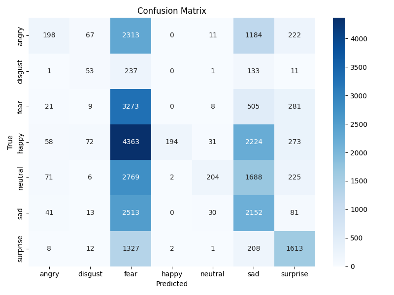

# 🧠 Vision Foundation Model-based Emotion Detection

> Detecting facial emotions using DINOv2 (a Vision Foundation Model by Meta AI) and classifying them with MLP.

## 🔍 Overview

This project demonstrates how to recognize human facial emotions using [DINOv2](https://github.com/facebookresearch/dinov2), a Vision Transformer pretrained in a self-supervised fashion. Instead of training a full model, we extract high-quality features from DINOv2 and use an MLP to classify emotions from the FER2013 dataset.

- **Model:** DINOv2 (`vit_small_patch16_224.dino`)
- **Dataset:** FER2013 (7 emotion classes)
- **Classifier:** MLP on top of frozen embeddings
- **Accuracy:** ~58% (without fine-tuning)

## 📁 Project Structure
```bash
emotion-vfm/
├── data/ # FER2013 images in train/test/class folders
├── models/ # DINOv2 feature extractor
├── classifier/ # MLP classifier
├── utils/ # Dataset loader
├── notebooks/ # Evaluation & visualization
├── main.py # End-to-end pipeline
└── README.md
```

```bash
git clone https://github.com/<your-username>/emotion-vfm.git
```
```bash
cd emotion-vfm
pip install -r requirements.txt
```
```bash
python main.py
```

📊 Results
The classifier achieved ~58% accuracy on the FER2013 dataset. Here is the confusion matrix:


📜 License
MIT
